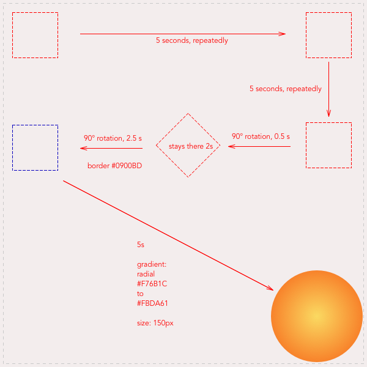

# css-animation-drill
[Website's link](https://pedroseromenho.github.io/css-animation-drill/)

## Instructions

Build a complex animation, step by step.
As often with CSS, this is an exercise in precision and accuracy (and a zest of dementia, because… CSS). To give a reliable visual assistant, use a technique that could be called “the image background guide Technique”.

## Layout

## CSS Methodology

- Animate div's *hero*.
- Use @keyframes to set rules depending on delay's.

## Useful Links

- [CSS Animation for beginners](https://robots.thoughtbot.com/css-animation-for-beginners)
- [CSS Animation Rules](https://marksheet.io/css-animations.html)

## Credits

Exercise realised at Becode, proposed by @pixeline.
@pedroseromenho